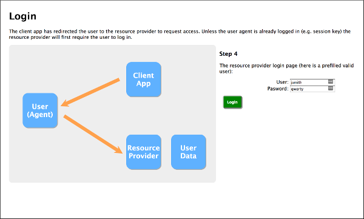

# OAUTH2 Deep Dive with oauth2-server

A click-through demostration of the oauth2 'authorization code' flow of the [oauth2 rfc](https://tools.ietf.org/html/rfc6749).
Implemented in Node.js with [oath2-server](https://github.com/oauthjs/node-oauth2-server).

Useful if you were curious about what exactly gets passed around during the handshake.

## Example View

## Running

A Node.js app,
* install [node](https://nodejs.org/) 
* installing node should also install `npm`.
* from within this directory...
* install dependencies

        npm install

* run server

        npm start

* then goto [http://localhost:3000/](http://localhost:3000/) and follow the links

